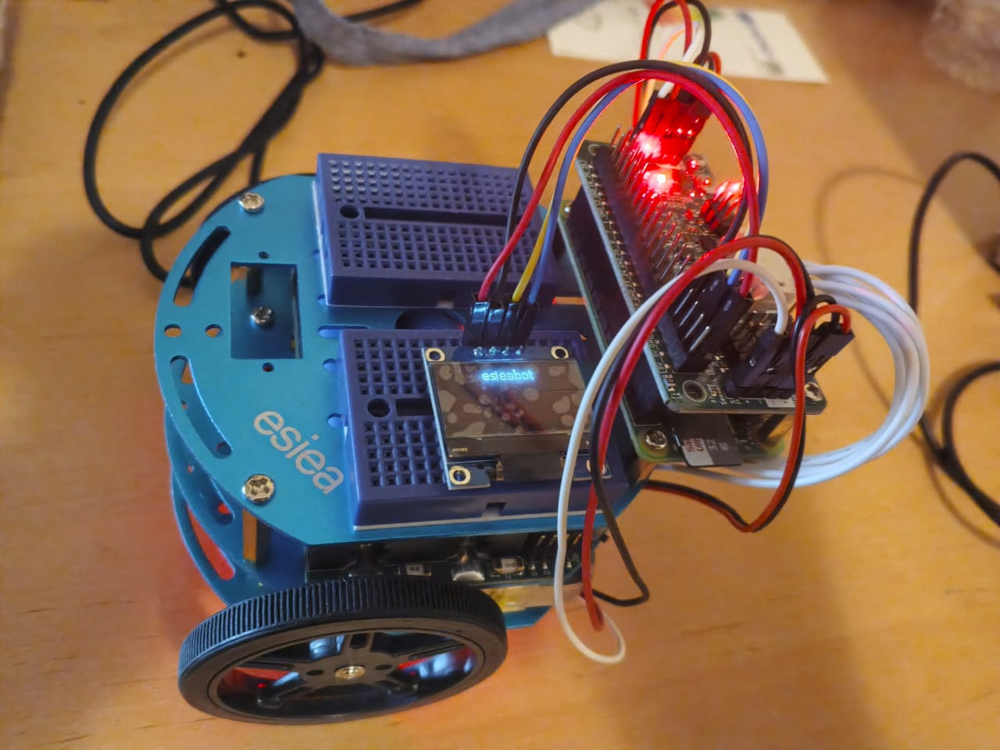
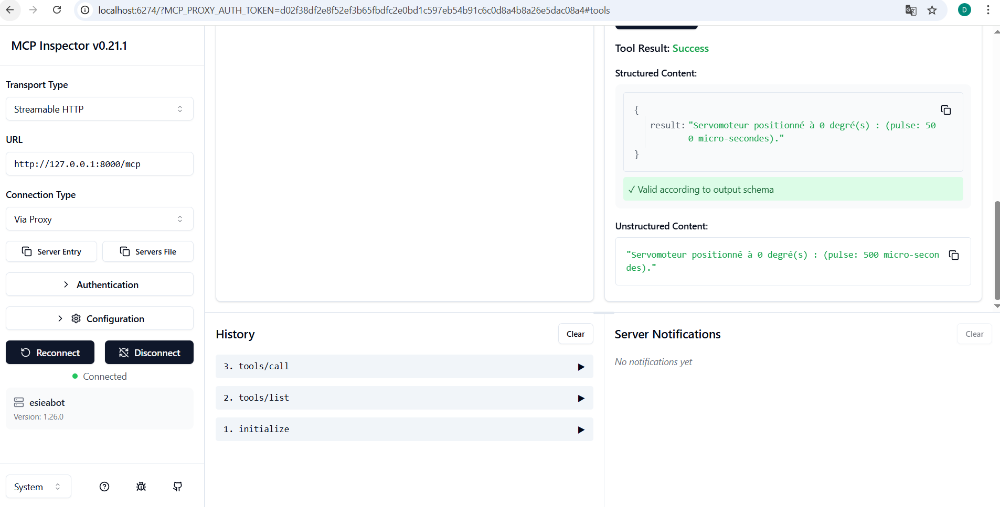

# Serveur MCP & Robot ESIEAbot
**Python Async  --  FastAPI  --  Pydantic  --  Raspberry Pi  --  JSON-RPC 2.0**
---
## Contexte et objectif
Ce projet a été réalisé dans le cadre du module Python ING3 de l'ESIEA (2025-2026).
Objectif : permettre à un LLM (Claude, Anthropic) de piloter physiquement un robot
via le protocole MCP (Model Context Protocol).
---
## Architecture technique
J'ai opté pour l'Architecture B : le serveur MCP tourne sur mon PC (localhost:8000)
et se connecte au Raspberry Pi via le réseau (port 8888 pour pigpiod).
Ce choix évite les problèmes de pare-feu scolaire et facilite le débogage.

*Le robot ESIEAbot avec l'afficheur OLED et les LEDs actives*

*Commande de l'ESIEABOT à partir de Claude Desktop*

*Mouvement du servo moteur grace à un signal PWM*
---
## Résultats obtenus- Serveur MCP opérationnel en mode simulation (stub pigpio)- Claude Desktop détecte et liste tous les outils esieabot- Commandes de déplacement et angle servo fonctionnent en simulation- Problème identifié : pigpiod n'écoute pas sur *:8888 (solution documentée)
---
## Technologies utilisées
| Technologie  | Rôle |
|--------------|------|
| Python asyncio | Architecture asynchrone du serveur |
| FastMCP        | Framework serveur MCP |
| Pydantic       | Validation des paramètres |
| pigpio         | Contrôle des GPIO du Raspberry Pi |
| JSON-RPC 2.0   | Protocole de communication MCP |
 ---
 
## Rapport et code source
 - [Télécharger le rapport TD3 (PDF)](assets/images/rapport_td3_mcp-1.pdf)- [Dépôt GitLab](https://gitlab.esiea.fr/dimitri.bahanag/mcp-esieabot)
